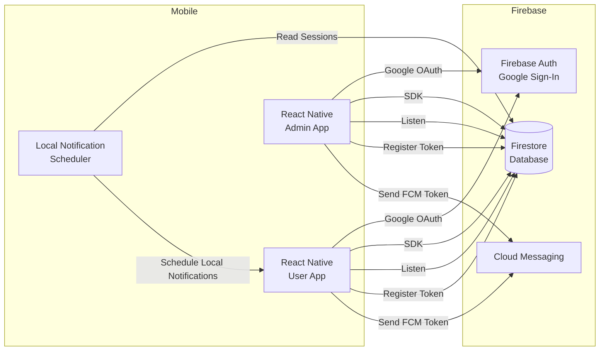
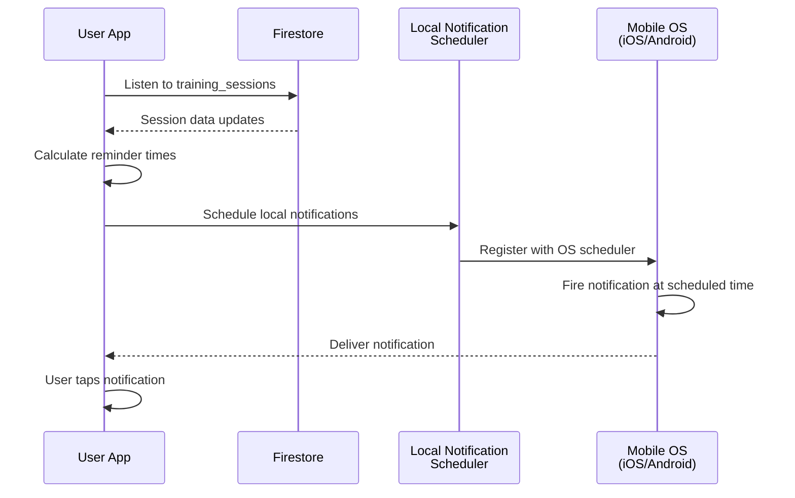
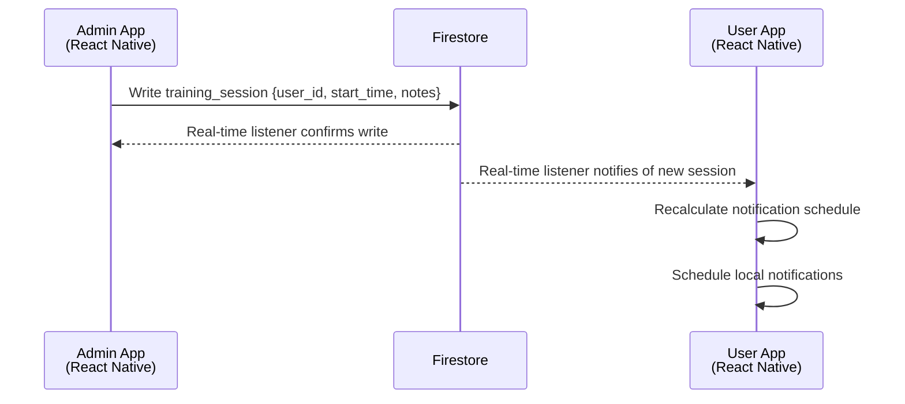

# System Design: Pilates Training Mobile Application

## 1. Overview
A cross-platform mobile application (iOS and Android) for Pilates training management with two roles:
- User (trainee) using Google Sign-In
- Admin (trainer/operator) using Google Sign-In (distinguished by role)

Core features: schedule management, class tracking, notes, push notifications, and role-based access.

## 2. Architecture
- **Mobile App (iOS/Android)**: React Native single codebase with Firebase SDK integration for push notifications and real-time updates.
- **Backend**: Firebase services (Firestore, Firebase Auth, Firebase Cloud Messaging).
- **Authentication**: Firebase Authentication with Google Sign-In (OAuth 2.0) for both users and admins. Role determined from Firestore `user` document.
- **Database**: Firestore for real-time data persistence, storing User, TrainingSession, DeviceToken, and NotificationPreference collections.
- **Push Notifications**: Firebase Cloud Messaging (FCM) for Android and iOS (via APNs bridge).
- **Notification Scheduling**: Client-side scheduled notifications using React Native's local notification system with Firestore listeners.
- **Observability**: Firebase Crashlytics for crash reporting, Cloud Logging for centralized logs.

**Note**: Firebase Spark plan is used. Cloud Functions and Cloud Scheduler are not available; notification scheduling is handled client-side.



## 3. Data Model
Firestore collections conform to requirements. Indexes optimized for query performance.

**User Collection**
```
users/ {docId} (UID from Firebase Auth)
  ├─ username: string
  ├─ gmail: string (indexed, unique)
  ├─ role: string (USER | ADMIN)
  ├─ status: string (IN_TRAINING | INACTIVE)
  ├─ created_at: timestamp
  └─ updated_at: timestamp
```

**TrainingSession Collection**
```
training_sessions/ {docId} (UUID)
  ├─ user_id: string (reference to User UID, indexed)
  ├─ created_by_id: string (reference to User UID)
  ├─ start_time: timestamp (indexed)
  ├─ end_time: timestamp
  ├─ status: string (SCHEDULED | COMPLETED | CANCELLED | NO_SHOW)
  ├─ notes: string
  ├─ created_at: timestamp
  └─ updated_at: timestamp
```

**DeviceToken Collection**
```
device_tokens/ {docId} (UUID)
  ├─ user_id: string (reference to User UID, indexed)
  ├─ platform: string (IOS | ANDROID)
  ├─ fcm_token: string (indexed, unique)
  ├─ last_seen_at: timestamp
  ├─ created_at: timestamp
  └─ updated_at: timestamp
```

**NotificationPreference Collection**
```
notification_preferences/ {user_id} (User UID as doc ID)
  ├─ enabled: boolean
  ├─ rule: string (24H | 1H | BOTH)
  └─ updated_at: timestamp
```

Firestore Indexes:
- `User.gmail` single field, ascending
- `TrainingSession.user_id, start_time` composite, ascending
- `DeviceToken.fcm_token` single field, ascending
- `DeviceToken.user_id` single field, ascending

## 4. Authentication & Authorization
- **Firebase Authentication**: Google Sign-In (OAuth 2.0) for both users and admins.
- **Role Management**: User role (`USER` or `ADMIN`) stored in Firestore `users` document. Retrieved on app startup.
- **First Admin Setup**: Initial admin account created manually in Firebase Console or via Firebase Admin SDK script (one-time operation). Subsequent admins can be created by existing admins via the app.
- **User Onboarding**: When a new user signs in via Google:
  1. App checks if user document exists in Firestore.
  2. If not, app creates user document with default `role=USER`, `status=INACTIVE`.
  3. Admin must change status to `IN_TRAINING` to activate user.
- **RBAC**: Firestore Security Rules enforce role-based access:
  - Users can only read/write their own data and assigned training sessions.
  - Admins can read/write all users, sessions, and device tokens.
- **Session Management**: Firebase automatically handles token refresh. Secure token storage via React Native Firebase SDK (Keychain/iOS, Keystore/Android).

## 5. Mobile Client Architecture (React Native)
- **Framework**: React Native with TypeScript for type safety.
- **State Management**: Redux Toolkit for global app state, React Context for local component state.
- **Firebase Integration**: `@react-native-firebase/app`, `@react-native-firebase/auth`, `@react-native-firebase/firestore`, `@react-native-firebase/messaging`.
- **Layers**:
  - **UI**: Screens (Login, Dashboard, Calendar, Settings) and reusable components.
  - **Redux Store**: Auth state, user profile, training sessions, notification settings.
  - **Firestore SDK**: Real-time listeners for data updates.
  - **FCM Service**: Device token registration, push notification handling.
  - **Storage**: Secure token storage via Keychain/Keystore (handled by Firebase SDK).
  - **Utilities**: Date/time formatting, timezone conversion, validators.

- **Key Screens**:
  - **Login**: Google Sign-In button, role-based navigation to User or Admin portal.
  - **User Dashboard**: Completed class count, next scheduled class, buttons to calendar and settings.
  - **Calendar**: Monthly default view, tap date for session details, real-time updates via Firestore listener.
  - **History & Upcoming**: List view with filters and pagination.
  - **Settings**: Toggle notifications, select reminder rule (24H/1H/BOTH).
  - **Admin Calendar**: Create/edit sessions, select user, view session notes, edit times/status.
  - **Admin User List**: Filter by status, sort by next class or completed count, edit user info.

- **Real-Time Updates**: Firestore listeners on `training_sessions` and `users` collections update local Redux state and UI components.
- **Timezone Handling**: All times stored in UTC in Firestore; client converts to local timezone for display using native libraries.
- **Offline Behavior**: Firestore offline persistence enabled; read-only when offline; queued writes synced on reconnect.

## 6. Backend Services (Firestore Only)

**Firestore Data Operations**

Since Cloud Functions are not available in Spark plan, all data writes happen directly from the mobile app to Firestore:

- **User Management**: Mobile app (Admin) writes to `users` collection.
- **Training Sessions**: Mobile app (Admin) writes to `training_sessions` collection.
- **Device Tokens**: Mobile app writes FCM token to `device_tokens` collection on startup.
- **Notification Preferences**: Mobile app writes to `notification_preferences` collection.

**Firestore Security Rules** (with Enhanced Validation)

```javascript
rules_version = '2';
service cloud.firestore {
  match /databases/{database}/documents {
    // Users: only own profile, admins see all
    match /users/{userId} {
      allow read: if request.auth.uid == userId || isAdmin(request.auth.uid);
      allow create: if request.auth.uid == userId && 
                       request.resource.data.role in ['USER', 'ADMIN'] &&
                       request.resource.data.status in ['IN_TRAINING', 'INACTIVE'] &&
                       request.resource.data.gmail is string &&
                       request.resource.data.gmail.matches('.*@.*\\..*');
      allow update: if (request.auth.uid == userId || isAdmin(request.auth.uid)) &&
                       request.resource.data.role in ['USER', 'ADMIN'] &&
                       request.resource.data.status in ['IN_TRAINING', 'INACTIVE'];
    }
    
    // Training sessions: users see own + assigned, admins see all
    match /training_sessions/{sessionId} {
      allow read: if isOwnerOrAdmin(resource.data.user_id, request.auth.uid);
      allow create: if isAdmin(request.auth.uid) &&
                       request.resource.data.user_id is string &&
                       request.resource.data.start_time is timestamp &&
                       request.resource.data.end_time is timestamp &&
                       request.resource.data.end_time > request.resource.data.start_time &&
                       request.resource.data.status in ['SCHEDULED', 'COMPLETED', 'CANCELLED', 'NO_SHOW'] &&
                       request.resource.data.created_by_id == request.auth.uid;
      allow update: if isAdmin(request.auth.uid) &&
                       request.resource.data.status in ['SCHEDULED', 'COMPLETED', 'CANCELLED', 'NO_SHOW'];
    }
    
    // Device tokens: own or admin
    match /device_tokens/{tokenId} {
      allow read: if resource.data.user_id == request.auth.uid || isAdmin(request.auth.uid);
      allow write: if request.resource.data.user_id == request.auth.uid &&
                      request.resource.data.platform in ['IOS', 'ANDROID'] &&
                      request.resource.data.fcm_token is string;
    }
    
    // Notification preferences: own or admin
    match /notification_preferences/{userId} {
      allow read: if request.auth.uid == userId || isAdmin(request.auth.uid);
      allow write: if (request.auth.uid == userId || isAdmin(request.auth.uid)) &&
                      request.resource.data.enabled is bool &&
                      request.resource.data.rule in ['24H', '1H', 'BOTH'];
    }
    
    // Helper functions
    function isAdmin(uid) {
      return get(/databases/$(database)/documents/users/$(uid)).data.role == 'ADMIN';
    }
    
    function isOwnerOrAdmin(ownerId, uid) {
      return uid == ownerId || isAdmin(uid);
    }
  }
}
```

## 7. Scheduling & Notifications (Client-Side)

**Notification Architecture** (Spark Plan)

Since Cloud Scheduler and Cloud Functions are not available in Spark plan, notification scheduling is handled client-side:

- **Local Notification Scheduler**: React Native app uses `@react-native-firebase/messaging` for FCM token registration and `react-native-notifications` library for local notification scheduling.

- **How It Works**:
  1. On app startup, app registers FCM token with Firestore `device_tokens` collection.
  2. App listens to `training_sessions` collection for updates (real-time Firestore listener).
  3. For each session assigned to the user, app calculates reminder times (24H, 1H before start_time based on user preferences).
  4. App schedules local notifications using native APIs:
     - **iOS**: UNUserNotificationCenter (system-level scheduling)
     - **Android**: WorkManager (recommended) or AlarmManager for exact-time delivery
  5. When the scheduled time arrives, the OS fires the local notification directly to the user's device.
  6. User taps notification → app opens to session details.

- **User Notification Preferences**:
  - Users can enable/disable notifications in Settings.
  - Users can select reminder rule: 24H, 1H, or BOTH.
  - Settings stored in `notification_preferences` collection.

- **Local Notification Payload**:
  ```javascript
  {
    title: "Upcoming Training Session",
    body: "Your session starts in 24 hours",
    data: {
      session_id: "...",
      start_time: "2026-01-25T10:00:00Z",
      type: "session_reminder"
    },
    ios: {
      sound: "default",
      badge: 1
    },
    android: {
      channelId: "training_reminders",
      smallIcon: "ic_notification",
      priority: "high"
    }
  }
  ```
  
- **FCM Usage**: FCM is only used for device token registration and optional server-initiated messages (if upgraded to Blaze plan in future). Current implementation uses local notifications only.

- **Limitations**:
  - Notifications require app to be running or woken by local scheduler.
  - If user uninstalls app, notifications are lost (no server-side persistence).
  - Scaling is limited by device battery and local storage.

**Recommendation for Production**:
Consider upgrading to Firebase Blaze plan to use Cloud Functions + Cloud Scheduler for reliable server-side notification delivery.

Sequence: Client-Side Notification Flow


## 8. Admin Portal: Calendar & Session Editing
- **Session Creation**:
  - Admin taps date on calendar → modal opens.
  - Select user (dropdown, ordered by username ascending).
  - Display user stats: completed class count, last 5 training notes (most recent first).
  - Enter session time (start/end) and training notes.
  - Submit → Write `training_session` document to Firestore directly.
  - Mobile app listens to Firestore and updates admin calendar in real-time.

- **Session Editing**:
  - Admin taps existing session → edit modal.
  - Update time, notes, or status (COMPLETED, CANCELLED, NO_SHOW).
  - Submit → Update `training_session` document in Firestore.
  - Firestore listeners notify all connected clients (users, other admins) of changes.

- **Status Lifecycle**: `SCHEDULED` → `COMPLETED/CANCELLED/NO_SHOW`.

- **Notification Update**: When session is created or rescheduled, user's app (listening to Firestore) recalculates notification schedules locally.

Sequence: Admin Create Session


## 9. Dashboard & Calendar Logic
- **Dashboard Data** (calculated client-side):
  - **Completed classes**: App queries Firestore for sessions where `user_id == current_user`, `end_time < now`, and `status != CANCELLED`. Count is calculated in Redux reducer or React component using `.length`.
  - **Next scheduled class**: App queries Firestore for sessions where `user_id == current_user`, `start_time > now`, `status == SCHEDULED`, ordered by `start_time` ascending, limit 1.
  - Data cached in Redux store; updated via Firestore real-time listeners.
  
- **Calendar**:
  - Monthly default view using React Native Calendar library.
  - Firestore query: fetch all sessions for current user within visible month range.
  - Tap date → show session details modal (date, time, status, notes).
  - Real-time updates: Firestore listener on `training_sessions` collection updates calendar markers automatically.

## 10. Security
- **OAuth 2.0**: Firebase Authentication handles Google verification and token issuance.
- **Transport Security**: All Firebase SDK communications use TLS 1.3+.
- **Secure Token Storage**: React Native Firebase SDK stores auth tokens in Keychain (iOS) / Keystore (Android).
- **Firestore Security Rules**: Enforce role-based read/write access with field-level validation (see section 6):
  - Role and status enum validation
  - Email format validation
  - Timestamp validation (end_time > start_time)
  - Owner/creator verification
- **Input Validation**: Client-side validation in React Native app before writing to Firestore:
  - Form validation using libraries like `react-hook-form` or `formik`
  - Schema validation using `zod` or `yup`
  - Server-side validation enforced by Security Rules
- **Audit Trail**: All Firestore writes include `created_at`, `updated_at`, and `created_by_id` fields for accountability.
- **Rate Limiting**: 
  - Firebase provides built-in DDoS protection at SDK level
  - Spark plan quotas (50K reads, 20K writes/day) act as natural rate limits
  - Monitor usage in Firebase Console to detect anomalies
- **Data Privacy**: Minimize PII storage; only gmail and username stored. No payment or sensitive health data.

## 11. Performance & Scalability
- **Firestore Indexes**: Optimized composite indexes for:
  - `training_sessions.user_id + start_time` (for calendar queries)
  - `users.gmail` (for unique constraint and admin searches)
  - `device_tokens.user_id` (for token lookups)
- **Real-Time Listeners**: Mobile app listens to Firestore collections with query filters:
  - User app: listens to own sessions only (`where('user_id', '==', uid)`)
  - Admin app: listens to all sessions or filtered by date range
  - Automatic sync reduces latency; UI updates in real-time
- **Pagination**: Admin user list paginated using Firestore cursor-based pagination:
  - Initial query: `limit(20)`
  - Next page: `startAfter(lastDocument).limit(20)`
- **Query Optimization**: 
  - Dashboard queries use `.limit(1)` for next session
  - Calendar queries filtered by month range to reduce data transfer
  - Redux store caches query results to avoid redundant Firestore reads
- **Offline Sync**: Firestore offline persistence enabled:
  - Queued writes synced on reconnect
  - Read-only access to cached data when offline
  - Conflict resolution: last-write-wins (Firestore default)
- **Spark Plan Scaling**: With 50K reads/day and 20K writes/day:
  - Supports ~100 active users (avg 500 reads + 200 writes per user per day)
  - Monitor usage in Firebase Console; upgrade to Blaze if limits exceeded

## 12. Observability & Operations
- **Cloud Logging**: Firestore operations are logged automatically by Firebase.
- **Crashlytics**: Mobile app crashes and errors reported automatically via Firebase SDK.
- **Manual Monitoring**: Track Firestore usage in Firebase Console (read/write operations, storage).
- **Custom Analytics**: Firebase Analytics SDK integrated in React Native app to track user events (session created, notification scheduled, etc.).
- **Limitations**: Cloud Monitoring advanced metrics not available in Spark plan. Monitor via Firebase Console dashboard.

## 13. Testing Strategy
- **Unit Tests**:
  - Time calculations (UTC conversion, reminder time calculation)
  - Status transitions (SCHEDULED → COMPLETED/CANCELLED)
  - Notification scheduling logic (24H, 1H, BOTH rules)
  - Redux reducers and selectors
  - Utility functions (validators, formatters)
  
- **Integration Tests**:
  - Firebase Auth flows (Google Sign-In, role retrieval)
  - Firestore Security Rules (test with Firebase Emulator Suite)
  - Real-time listener updates (session created → Redux state updated)
  - Offline persistence and sync
  
- **E2E Tests** (using Detox or Appium):
  - User flow: Login → Dashboard → View calendar → Check session details
  - Admin flow: Login → Create session → Edit session → Update user status
  - Notification flow: Create session → Verify local notification scheduled
  
- **Mobile UI Tests**:
  - Calendar interactions (tap date, view details, navigate months)
  - Settings toggles (enable/disable notifications, select reminder rule)
  - Form validation (admin session creation with invalid inputs)

## 14. Deployment & DevOps
- **Mobile App**: Built and distributed via App Store (iOS) and Google Play (Android) using EAS or Fastlane.
- **Firestore**: Schema managed through Firebase Console; indexes created via console or rules config.
- **CI/CD**: GitHub Actions (or similar) triggers tests and mobile app builds on push.
- **Secrets Management**: Firebase Console manages Google OAuth client ID/secret.
- **Environment Configuration**: Environment-specific Firebase projects (dev, staging, prod) with separate Firestore instances.
- **Spark Plan Limits**: 
  - 50,000 read operations/day
  - 20,000 write operations/day
  - 1 GB storage
  - Monitor usage in Firebase Console.

## 15. Risks & Mitigations
- **Timezone errors** → Enforce UTC storage in Firestore; client-side conversion to local timezone; comprehensive unit tests for edge cases (DST transitions).
- **Token expiration** → Firebase SDK auto-refreshes tokens; handle auth state changes gracefully in app.
- **Notification reliability** (Spark plan limitation):
  - Risk: Local notifications require app to schedule them; if app uninstalled or data cleared, notifications lost.
  - Mitigation: Re-schedule notifications on app startup; prompt users to keep notifications enabled.
  - Long-term: Upgrade to Blaze plan for server-side Cloud Functions scheduling.
- **Quota exhaustion** (Spark plan 50K reads, 20K writes/day):
  - Risk: Heavy usage exceeds free tier limits.
  - Mitigation: Monitor usage in Firebase Console; optimize queries (use caching, limit real-time listeners); upgrade to Blaze if needed.
- **Data privacy** → Minimize PII storage (only gmail, username); enforce RBAC via Security Rules; audit logs via Firestore metadata.
- **First admin setup** → Initial admin created manually in Firebase Console (one-time operation); document process in setup guide.
- **Security Rules complexity** → Test rules using Firebase Emulator Suite; write comprehensive integration tests.

## 16. Future Enhancements
- In-app payments or subscription tracking (Stripe integration via Cloud Functions).
- Firebase Analytics for attendance trends, user engagement, and cohort analysis.
- Multi-trainer support and hierarchical role system (e.g., TRAINER, MANAGER).
- Calendar sync (Google/Apple Calendar) with user consent via `@react-native-community/hooks`.
- SMS notifications as fallback or preference (Twilio integration).
- AI-driven workout recommendations based on training history (Firebase ML Kit).
