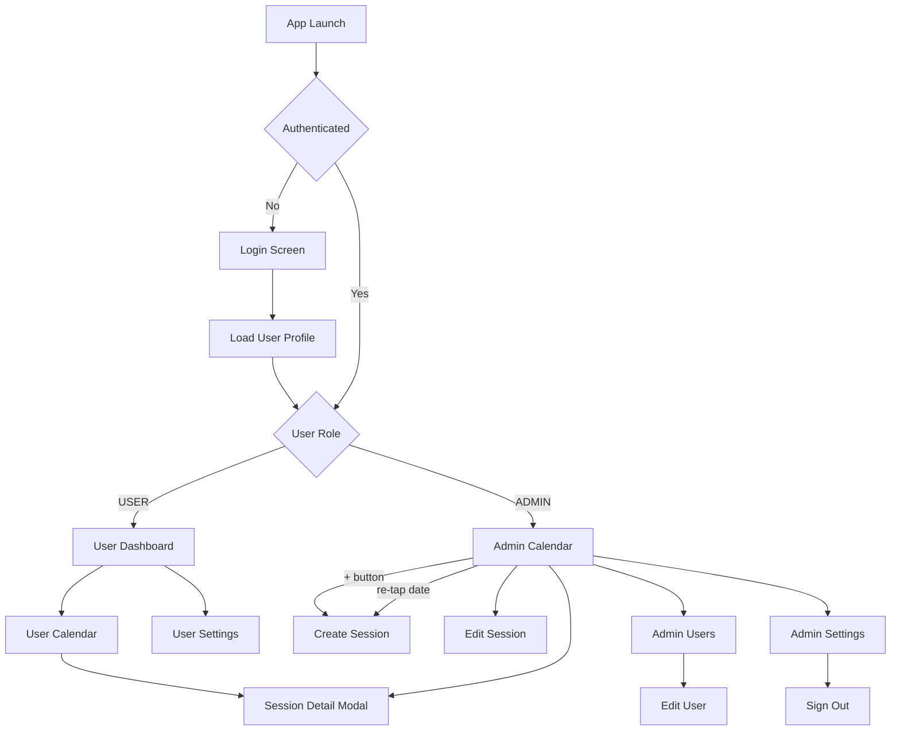

# Expo Implementation Document

## 1. Scope and Inputs

This implementation document is based on:
- UI source: `docs/UI/pilates-app-ui.html`
- System design source: `docs/system-design-expo-firebase-notifications.md`
- Current Expo app baseline: `expo/lu-training` (Expo Router starter with Firebase and Notifications dependencies already installed)

Goal:
- Translate UI and architecture into an implementation-ready plan for pages, folder/file structure, functions, and runtime behavior.

## 2. Core Product Summary

Roles:
- `USER` (trainee): view dashboard, calendar, session details, settings, and reminders
- `ADMIN` (trainer): manage sessions and users

Core backend services:
- Firebase Authentication (Google sign-in)
- Cloud Firestore (users, sessions, preferences, tokens)
- Expo Notifications (local reminders, token registration)

App constraints:
- No custom backend server
- Firestore Security Rules enforce RBAC
- Real-time updates through Firestore listeners

## 3. Page Outline (Route Plan)

### 3.1 Shared/Auth

| Route | Screen Name | Role | Purpose | Primary Data |
|---|---|---|---|---|
| `/auth/login` | Login | Shared | Google sign-in and profile bootstrap | Firebase Auth, `users/{uid}` |
| `/modal/session/[sessionId]` | Session Detail Modal | USER, ADMIN | View full session detail and notes | `training_sessions/{sessionId}` |

### 3.2 User App

| Route | Screen Name | Purpose | Primary Data |
|---|---|---|---|
| `/user/(tabs)/dashboard` | User Dashboard | Summary cards, next session, quick actions | sessions (derived), user profile |
| `/user/(tabs)/calendar` | User Calendar | Monthly calendar and upcoming session list | sessions by date window |
| `/user/settings` | User Settings | Notification enable/rule and account actions | `notification_preferences/{uid}` |

### 3.3 Admin App

| Route | Screen Name | Purpose | Primary Data |
|---|---|---|---|
| `/admin/(tabs)/calendar` | Admin Calendar | Calendar and day session list | sessions by date window + status |
| `/admin/session/create` | Create Session | Create session with user selection and notes | users, sessions |
| `/admin/session/[sessionId]/edit` | Edit Session | Update status/time/notes or cancel | `training_sessions/{sessionId}` |
| `/admin/(tabs)/users` | Admin User List | Search/filter users and open detail/edit | users, derived stats |
| `/admin/(tabs)/settings` | Admin Settings | Account info and sign out | auth profile |
| `/admin/user/[uid]/edit` | Add/Edit User | Update user profile and status | `users/{uid}` |

### 3.4 Navigation Flow (Mermaid)



## 4. Target Folder and File Structure (Expo Router)

Use this as the target implementation structure under `expo/my-app`.

```text
expo/my-app/
  app/
    _layout.tsx

    auth/
      _layout.tsx
      login.tsx

    user/
      _layout.tsx
      settings.tsx
      (tabs)/
        _layout.tsx
        dashboard.tsx
        calendar.tsx

    admin/
      _layout.tsx
      session/
        create.tsx
        [sessionId]/
          edit.tsx
      user/
        [uid]/
          edit.tsx
      (tabs)/
        _layout.tsx
        calendar.tsx
        users.tsx
        settings.tsx

    modal/
      session/
        [sessionId].tsx

  components/
    common/
      ScreenContainer.tsx
      AppHeader.tsx
      EmptyState.tsx
      StatusBadge.tsx
      ConfirmDialog.tsx
    session/
      SessionCard.tsx
      SessionForm.tsx
      SessionStatusSelector.tsx
      SessionNotesEditor.tsx
      SessionList.tsx
    calendar/
      CalendarMonthGrid.tsx
      DayMarker.tsx
    user/
      UserCard.tsx
      UserFilterTabs.tsx
      UserSearchInput.tsx
    settings/
      NotificationToggle.tsx
      ReminderRuleSelector.tsx

  features/
    auth/
      auth.slice.ts
      auth.selectors.ts
      auth.types.ts
      auth.service.ts
      useAuthBootstrap.ts
    sessions/
      sessions.slice.ts
      sessions.selectors.ts
      sessions.types.ts
      sessions.service.ts
      sessions.listener.ts
      sessions.scheduler.ts
    users/
      users.slice.ts
      users.selectors.ts
      users.types.ts
      users.service.ts
    notifications/
      notifications.slice.ts
      notifications.types.ts
      notifications.service.ts
      notificationPermissions.ts
      notificationScheduler.ts
      notificationIds.ts

  lib/
    firebase/
      app.ts
      auth.ts
      firestore.ts
      converters.ts
      collections.ts
    validation/
      session.schema.ts
      user.schema.ts
      preference.schema.ts
    date/
      timezone.ts
      calendar.ts
      formatting.ts
    permissions/
      roleGuards.ts

  store/
    index.ts
    rootReducer.ts
    hooks.ts

  hooks/
    useAuthGate.ts
    useRoleRoute.ts
    useCurrentUser.ts
    useSessionStats.ts
    useSessionByMonth.ts

  constants/
    routes.ts
    enums.ts
    statusColors.ts

  types/
    domain.ts
    dto.ts

  docs/
    fireStore-rules-notes.md
```

## 5. Firestore Model Mapping

Collections:
- `users/{uid}`
- `training_sessions/{sessionId}`
- `notification_preferences/{uid}`
- `device_tokens/{tokenId}`

Type model (recommended):
- `UserRole = 'USER' | 'ADMIN'`
- `UserStatus = 'INACTIVE' | 'IN_TRAINING'`
- `SessionStatus = 'SCHEDULED' | 'COMPLETED' | 'CANCELLED' | 'NO_SHOW'`
- `ReminderRule = '24H' | '1H' | 'BOTH'`

## 6. Function Catalog and Behavior

This section lists key functions and how they should work.

### 6.1 Authentication Functions

`signInWithGoogle(): Promise<AuthUser>`
- Runs Expo Google OAuth flow.
- Exchanges Google token to Firebase credential.
- Calls `signInWithCredential`.
- Returns authenticated Firebase user.

`bootstrapUserProfile(uid: string): Promise<UserProfile>`
- Reads `users/{uid}`.
- Validates role/status shape.
- Fails fast if profile is missing.

`routeAfterAuth(profile: UserProfile): string`
- Returns route by role.
- `USER -> /user/(tabs)/dashboard`
- `ADMIN -> /admin/(tabs)/calendar`

`signOutAndCleanup(): Promise<void>`
- Cancels active listeners.
- Clears redux slices.
- Optionally clears pending local notifications bound to user.
- Signs out Firebase auth and navigates to login.

### 6.2 Session Query and Mutation Functions

`listenUserSessions(uid: string, fromUtc: Date, toUtc: Date): Unsubscribe`
- Firestore query: `user_id == uid` and bounded date window.
- Applies snapshot updates into normalized store.
- Used by user dashboard/calendar.

`listenAdminSessions(fromUtc: Date, toUtc: Date): Unsubscribe`
- Firestore query by time window.
- Supports admin calendar and day agenda views.

`createSession(input: CreateSessionInput, adminUid: string): Promise<string>`
- Validates input (`zod` schema).
- Writes `training_sessions` with UTC timestamps and server timestamps.
- Returns created `sessionId`.

`updateSession(sessionId: string, patch: UpdateSessionInput): Promise<void>`
- Validates allowed fields.
- Updates status/time/notes and `updated_at`.
- UI should enforce valid status transitions.

`cancelSession(sessionId: string): Promise<void>`
- Convenience wrapper to set status `CANCELLED`.
- Should trigger reminder cleanup via scheduler refresh.

### 6.3 User Management Functions

`listenUsers(filter: UserFilter): Unsubscribe`
- Supports search text and status filters (`IN_TRAINING`, `INACTIVE`).
- Feeds admin user list page.

`updateUser(uid: string, patch: UpdateUserInput): Promise<void>`
- Updates username/email/status.
- Validates with schema and writes `updated_at`.

`getUserSummary(uid: string): Promise<UserSummary>`
- Returns profile + derived training stats for admin edit screen.

### 6.4 Notification Functions

`ensureNotificationPermission(): Promise<PermissionState>`
- Requests permission if not already granted.
- Returns grant state for UI and scheduling guard.

`upsertDeviceToken(uid: string): Promise<void>`
- Gets Expo push token.
- Upserts token doc in `device_tokens` with `last_seen_at` and platform.

`saveNotificationPreference(uid: string, enabled: boolean, rule: ReminderRule): Promise<void>`
- Writes `notification_preferences/{uid}`.
- Triggers local reschedule after success.

`buildReminderPlan(session: Session, rule: ReminderRule): ReminderRequest[]`
- Creates reminder times relative to session start (`24H`, `1H`, `BOTH`).
- Skips any reminder in the past.

`syncSessionReminders(uid: string, sessions: Session[], pref: NotificationPreference): Promise<void>`
- Computes deterministic IDs via `getReminderId(sessionId, rule)`.
- Cancels stale notifications.
- Schedules missing notifications.
- Stores scheduler metadata in local store.

### 6.5 Derived Selector Functions

`selectCompletedClassCount(state, uid): number`
- Counts user sessions with status `COMPLETED`.

`selectNextUpcomingSession(state, uid, now): Session | null`
- Picks nearest future `SCHEDULED` session.

`selectSessionsGroupedByLocalDate(state, uid, monthKey): Record<string, Session[]>`
- Used for calendar markers and daily list rendering.

`selectAdminDayAgenda(state, dayKey, filters): Session[]`
- Returns sorted sessions for selected day in admin calendar.

## 7. Screen-by-Screen Runtime Behavior

### 7.1 Login (`/auth/login`)
- Render Google sign-in button.
- On tap -> `signInWithGoogle`.
- Then `bootstrapUserProfile` and `routeAfterAuth`.
- Error states: auth canceled, profile missing, network unavailable.

### 7.2 User Dashboard (`/user/(tabs)/dashboard`)
- Start `listenUserSessions` for active month window.
- Use selectors for completed count and next upcoming session.
- Quick actions route to calendar and history extension (future).

### 7.3 User Calendar (`/user/(tabs)/calendar`)
- Month switch updates date window query.
- Calendar dots from grouped sessions by status.
- Tapping day/session opens `/modal/session/[sessionId]`.

### 7.4 Session Modal (`/modal/session/[sessionId]`)
- Resolve session from store first, fallback read by id if missing.
- Show date/time/status/notes.

### 7.5 User Settings (`/user/settings`)
- Load and render current preference.
- Toggle notification enable and reminder rule.
- On change: persist with `saveNotificationPreference` then run `syncSessionReminders`.

### 7.6 Admin Calendar (`/admin/(tabs)/calendar`)
- Start `listenAdminSessions` for month window.
- Calendar grid shows coloured day-dots but no status legend (Completed / Scheduled / Cancelled labels are omitted).
- Day session list shows user, time, and note preview; the "Scheduled" status badge is hidden (other statuses still display).
- Re-tapping an already-selected date navigates to Create Session (`/admin/session/create?date=YYYY-MM-DD`) with the date passed as a query parameter.

### 7.6a Admin Settings (`/admin/(tabs)/settings`)
- Displays admin account info (name and email from auth profile).
- Sign Out button with confirmation alert; calls `signOutAndCleanup`.

### 7.7 Create Session (`/admin/session/create`)
- Accepts optional `date` query parameter (`YYYY-MM-DD`). When provided, the date field is prefilled with the given value; otherwise defaults to tomorrow.
- Select user and prefetch last notes summary.
- Fill date/time/notes.
- Submit calls `createSession`.
- On success: navigate back to admin calendar; listener updates automatically.

### 7.8 Edit Session (`/admin/session/[sessionId]/edit`)
- Load current session and readonly user card.
- Update status, date/time, notes.
- Save calls `updateSession`; cancel action calls `cancelSession`.

### 7.9 Admin Users (`/admin/(tabs)/users`)
- Start `listenUsers` with search/filter state.
- Show status chips and summary metrics.
- Tap user opens edit screen.

### 7.10 Add/Edit User (`/admin/user/[uid]/edit`)
- Display editable profile fields and status.
- Save calls `updateUser`.

## 8. State Management Plan (Redux Toolkit)

Recommended slices:
- `authSlice`: auth user, profile, auth status
- `sessionsSlice`: normalized session entities + query window metadata
- `usersSlice`: admin user list + user detail cache
- `notificationsSlice`: permission state, preference cache, scheduler metadata

Pattern:
- Services do IO (Firebase/Expo APIs).
- Slices store entities and status.
- Selectors derive UI-specific values.
- Hooks coordinate listener lifecycle and screen logic.

## 9. Error Handling and Guards

Guards:
- Role-based route protection with `useRoleRoute`.
- Fallback screen for unauthorized route entry.

Error categories:
- Auth errors (OAuth cancel/failure)
- Permission errors (notifications denied)
- Firestore write rejection by rules
- Validation errors for forms

UX rules:
- Inline form error messages for validation.
- Non-blocking toast for transient network failures.
- Retry action for critical write failures.

## 10. Suggested Implementation Sequence

1. Foundation
- Setup `lib/firebase/*`, store, domain types, and route constants.

2. Auth and role routing
- Build `/auth/login`, bootstrap profile, and route guards.

3. User flow MVP
- Dashboard, calendar, session modal, settings with preference writes.

4. Admin flow MVP
- Admin calendar, create/edit session, users list, edit user.

5. Notifications
- Permission flow, token upsert, reminder scheduler sync.

6. Hardening
- Empty/loading/error states, form validation, offline and edge-case testing.

## 11. Acceptance Checklist

- User can sign in and is routed by role.
- User dashboard displays completed count and next session.
- User calendar displays month sessions and session detail modal.
- User settings persist notification preference and reschedule reminders.
- Admin can create and edit sessions.
- Admin can search/filter users and update user profile/status.
- Firestore listeners provide real-time UI updates across roles.
- Security rules enforce role authorization for all writes.
