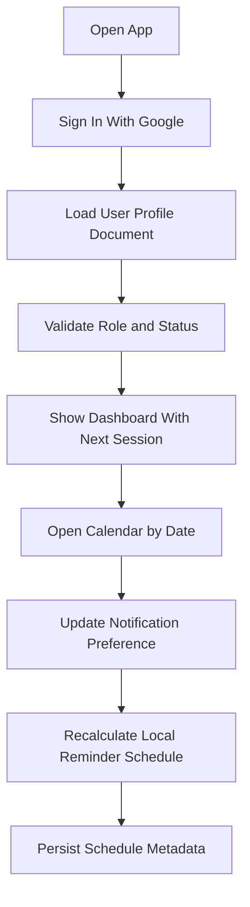
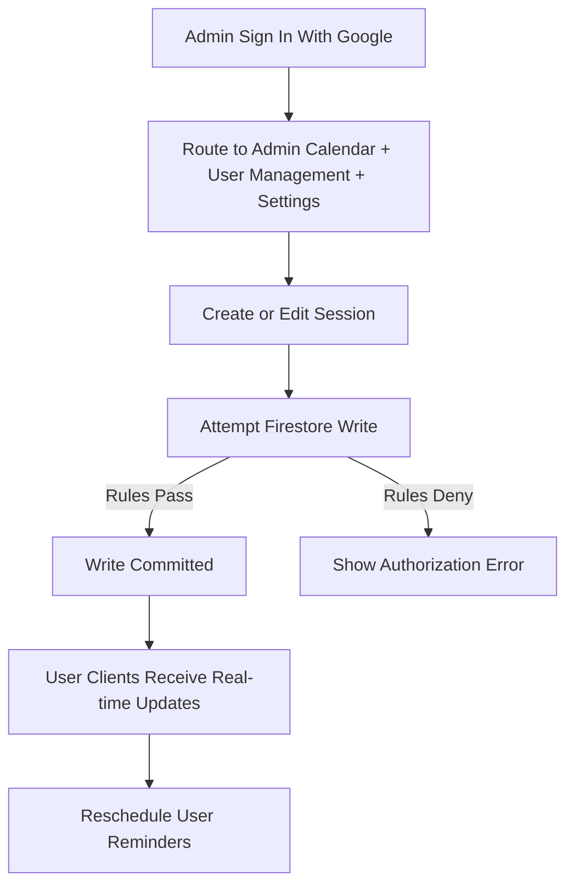

# System Design Document: Pilates Training App (Expo + Firebase JS SDK + Expo Notifications)

**Document Version:** 1.0  
**Last Updated:** March 4, 2026  
**Audience:** Engineering team (mobile + backend + QA)

---

## System Purpose

This system is a cross-platform mobile app built with Expo and TypeScript for Pilates training operations.

Two user roles are supported:
- **User (Trainee):** view assigned sessions, track class history, manage reminder preferences, receive notifications
- **Admin (Trainer):** manage users, create/edit sessions, update session status/notes

The backend is fully Firebase-based using the JavaScript SDK:
- **Firebase Authentication** for Google login
- **Cloud Firestore** for all persistent data and real-time synchronization
- **Expo Notifications** for permission handling, local scheduling, notification response routing, and push token registration

Because the app targets a no-server workflow, all primary business operations are executed from the client with Firestore Security Rules enforcing authorization.

---

## Core Workflows

### User flow


1. User opens app and signs in with Google.
2. App resolves user profile from `users/{uid}` and validates role/status.
3. Dashboard displays completed class count and next upcoming session.
4. Calendar shows sessions by date.
5. User updates notification preferences (`24H`, `1H`, `BOTH`, or disabled).
6. Scheduler recalculates local reminders and stores schedule metadata.

### Admin flow


1. Admin signs in with Google.
2. App routes to admin calendar, user management, and settings (with sign out).
3. Admin creates/edits sessions (time, notes, status). Tapping an already-selected date on the calendar is a shortcut to create a new session with that date prefilled.
4. Firestore write succeeds if security rules pass.
5. User clients receive real-time updates and reschedule reminders.

---

## Architecture Overview

### Client architecture (Expo app)
- **Framework:** Expo + React Native + TypeScript
- **Navigation:** Expo Router
- **State:** Redux Toolkit (or Zustand if preferred by team) with slices for auth, users, sessions, preferences
- **Data:** Firebase JS SDK (`firebase/app`, `firebase/auth`, `firebase/firestore`)
- **Notifications:** `expo-notifications`
- **Date handling:** `date-fns` + timezone helpers

### Backend architecture
- **Auth:** Firebase Authentication (Google provider)
- **Database:** Cloud Firestore (single source of truth)
- **Authorization:** Firestore Security Rules RBAC

### High-level data flow
1. UI triggers action.
2. Action invokes Firebase JS SDK call.
3. Firestore write/read happens under Security Rules.
4. Snapshot listeners push updates back to client state.
5. Notification scheduler consumes session + preference state and updates pending local notifications.

---

## Firebase Project Configuration

### Required Firebase services
- Authentication (Google sign-in enabled)
- Cloud Firestore
- App Check (recommended for production hardening)

### Required Expo configuration
- iOS and Android bundle/package IDs configured in `app.json`
- Push capability and notification permission prompts
- Notification channel setup on Android

### Environment variables
- `EXPO_PUBLIC_FIREBASE_API_KEY`
- `EXPO_PUBLIC_FIREBASE_AUTH_DOMAIN`
- `EXPO_PUBLIC_FIREBASE_PROJECT_ID`
- `EXPO_PUBLIC_FIREBASE_STORAGE_BUCKET`
- `EXPO_PUBLIC_FIREBASE_MESSAGING_SENDER_ID`
- `EXPO_PUBLIC_FIREBASE_APP_ID`

---

## Authentication and RBAC

### Sign-in design
- Use Google OAuth from Expo flow (`expo-auth-session/providers/google`).
- Exchange Google credential into Firebase Auth credential (`GoogleAuthProvider.credential(idToken)`).
- Sign in to Firebase (`signInWithCredential`).
- Fetch `users/{uid}` document.

### Role model
- `role`: `USER | ADMIN`
- `status`: `INACTIVE | IN_TRAINING`

### Admin bootstrap
- First admin is manually promoted via Firebase Console (or one-time script).
- App does not auto-create admins.

### Security model
- Client UI hides unauthorized controls.
- Firestore Security Rules are source of truth for access control.

---

## Firestore Data Model

### `users/{uid}`
```json
{
  "username": "string",
  "email": "string",
  "role": "USER | ADMIN",
  "status": "INACTIVE | IN_TRAINING",
  "created_at": "timestamp",
  "updated_at": "timestamp"
}
```

### `training_sessions/{sessionId}`
```json
{
  "user_id": "uid",
  "created_by_id": "uid",
  "start_time": "timestamp",
  "end_time": "timestamp",
  "status": "SCHEDULED | COMPLETED | CANCELLED | NO_SHOW",
  "notes": "string",
  "created_at": "timestamp",
  "updated_at": "timestamp"
}
```

### `notification_preferences/{uid}`
```json
{
  "enabled": true,
  "rule": "24H | 1H | BOTH",
  "updated_at": "timestamp"
}
```

### `device_tokens/{tokenId}`
```json
{
  "user_id": "uid",
  "platform": "IOS | ANDROID",
  "provider": "EXPO",
  "token": "ExpoPushToken[...]",
  "last_seen_at": "timestamp",
  "created_at": "timestamp",
  "updated_at": "timestamp"
}
```

### Suggested indexes
- `training_sessions`: `(user_id ASC, start_time ASC)`
- `training_sessions`: `(status ASC, start_time ASC)`
- `training_sessions`: `(user_id ASC, status ASC, start_time ASC)`
- `users`: `(status ASC, username ASC)` for admin filtering
- `device_tokens`: `(user_id ASC, updated_at DESC)`

---

## Firestore Operations

### Admin reads sessions
- Query by time window
- Date bounded query for calendar month view

### Admin creates session
- Validate user exists and is eligible
- Write `training_sessions`
- Use server timestamps
- Keep all times in UTC

### Admin updates session
- Update `start_time`, `end_time`, `status`, `notes`, `updated_at`
- Disallow invalid state transitions in UI + rules constraints

### Preference update
- User writes own `notification_preferences/{uid}`
- Trigger rescheduling process in app immediately

### Token registration
- On startup/sign-in and token refresh, upsert `device_tokens`

---

## Real-Time Sync Strategy

### Listener scope
- User client: listen only to own sessions in bounded date ranges
- Admin client: listen by month/date range, not full unbounded collection in production

### State update pattern
- Snapshot -> normalize documents -> merge into store
- Derived selectors calculate:
  - completed class count
  - next upcoming session
  - grouped sessions by local date

### Offline behavior
- Enable Firestore local persistence
- Queue writes while offline
- On reconnect, replay writes and reconcile snapshots

---

## Notification Scheduling Design (Expo Notifications)

### Scheduling approach
- All reminder scheduling is client-side local notifications.
- Scheduler runs when:
  - app startup
  - session snapshot changes
  - preference changes
  - timezone/date boundary significant changes

### Reminder rules
- `24H`: one notification at `start_time - 24h`
- `1H`: one notification at `start_time - 1h`
- `BOTH`: two notifications

### Scheduling constraints
- Skip notifications in the past.
- Deduplicate by deterministic notification IDs (sessionId + rule).
- Cancel pending reminders when session is cancelled/no-show/completed or moved.

### Pseudocode
```ts
function rescheduleReminders(sessions, prefs, nowUtc) {
  cancelAllManagedReminders();
  if (!prefs.enabled) return;

  for (const s of sessions) {
    if (s.status !== 'SCHEDULED') continue;

    const reminders = [];
    if (prefs.rule === '24H' || prefs.rule === 'BOTH') {
      reminders.push({ key: `${s.id}-24H`, at: subHours(s.start_time, 24), label: '24 hours' });
    }
    if (prefs.rule === '1H' || prefs.rule === 'BOTH') {
      reminders.push({ key: `${s.id}-1H`, at: subHours(s.start_time, 1), label: '1 hour' });
    }

    for (const r of reminders) {
      if (r.at <= nowUtc) continue;
      scheduleLocalNotification({
        identifier: r.key,
        title: 'Upcoming Training Session',
        body: `Your session starts in ${r.label}`,
        data: { sessionId: s.id, startTime: s.start_time.toISOString() },
        triggerDate: r.at,
      });
    }
  }
}
```

### Notification response handling
- On notification tap, route to session detail modal/screen.
- If session no longer exists or is not accessible, show safe fallback message.

### Known limitations
- Reminders are device-local; uninstall clears pending reminders.
- Aggressive battery restrictions can delay exact delivery on some Android devices.
- No guaranteed remote delivery without a server push sender.

---

## UI to Backend Mapping

### Login
- **UI:** Google sign-in CTA, loading, retry state
- **Backend:** Firebase Auth login + `users/{uid}` fetch/create default profile
- **Navigation:** role-based route split (user/admin)

### User Dashboard
- **UI:** completed classes, next session card
- **Backend:** session queries + derived selectors
- **Error state:** fallback cards and retry action

### User Calendar
- **UI:** monthly view + day detail
- **Backend:** month-bounded listener query

### Session Detail
- **UI:** date/time, status, notes
- **Backend:** read selected session document from store

### Settings
- **UI:** notification toggle + rule selector
- **Backend:** write `notification_preferences/{uid}` and reschedule

### Admin Calendar + Session Editor
- **UI:** create/edit form, status controls
- **Backend:** write/update `training_sessions`
- **Validation:** end_time > start_time, required user, note length cap

### Admin Settings
- **UI:** account info (name, email), sign out button with confirmation
- **Backend:** calls `signOutAndCleanup` to end Firebase auth session

### Admin User Management
- **UI:** filter by status, edit user metadata
- **Backend:** query/paginate `users`, update `status` and profile fields

---

## Business Rules

- Session statuses: `SCHEDULED -> COMPLETED | CANCELLED | NO_SHOW`
- Completed class count excludes `CANCELLED` and `NO_SHOW`
- Next session is earliest future `SCHEDULED` session
- All timestamps stored in UTC, displayed in local timezone
- Users can only modify their own preferences
- Only admins can create/update sessions and user statuses

---

## Security Considerations

- Enforce RBAC in Firestore Security Rules (never UI-only authz).
- Validate field types and allowed enums in rules.
- Restrict PII to minimal fields (name, email only).
- Always populate audit fields: `created_by_id`, `created_at`, `updated_at`.
- Use Firebase Emulator Suite to test deny/allow rule paths before release.

### Example rules skeleton
```javascript
rules_version = '2';
service cloud.firestore {
  match /databases/{database}/documents {
    function isAuthed() { return request.auth != null; }
    function isAdmin(uid) {
      return get(/databases/$(database)/documents/users/$(uid)).data.role == 'ADMIN';
    }

    match /users/{userId} {
      allow read: if isAuthed() && (request.auth.uid == userId || isAdmin(request.auth.uid));
      allow create: if isAuthed() && (request.auth.uid == userId || isAdmin(request.auth.uid));
      allow update: if isAuthed() && (request.auth.uid == userId || isAdmin(request.auth.uid));
    }

    match /training_sessions/{sessionId} {
      allow read: if isAuthed() && (
        resource.data.user_id == request.auth.uid || isAdmin(request.auth.uid)
      );
      allow create, update, delete: if isAuthed() && isAdmin(request.auth.uid);
    }

    match /notification_preferences/{userId} {
      allow read, write: if isAuthed() && (request.auth.uid == userId || isAdmin(request.auth.uid));
    }

    match /device_tokens/{tokenId} {
      allow read: if isAuthed() && (
        resource.data.user_id == request.auth.uid || isAdmin(request.auth.uid)
      );
      allow create, update: if isAuthed() && request.resource.data.user_id == request.auth.uid;
    }
  }
}
```

---

## Performance and Scaling Notes

- Keep listener queries bounded by user and date ranges.
- Prefer pagination/cursor queries for admin user lists.
- Avoid full collection scans in production screens.
- Keep reminder rescheduling idempotent and incremental when possible.
- Expected safe range for this architecture: small to medium workloads (~100 users) on Spark/early Blaze with disciplined query design.

---

## Testing Strategy

### Unit tests
- Reminder time calculation for 24H/1H/BOTH
- Timezone conversion and local day grouping
- Next session and completion counter selectors

### Integration tests
- Auth sign-in + role routing
- Firestore read/write permission behavior (Emulator)
- Listener-to-store synchronization

### E2E tests (Detox)
- User login, view calendar, update preferences
- Admin create/edit session flow
- Notification tap deep-link navigation

### Notification validation
- Verify local scheduling IDs
- Verify cancel/reschedule after session updates
- Verify behavior with disabled permissions

---

## Implementation Sequence

1. Initialize Expo project and env configuration.
2. Configure Firebase JS SDK and auth flow.
3. Implement user profile bootstrap and role routing.
4. Implement Firestore schema and indexes.
5. Build user calendar/dashboard reads with listeners.
6. Build admin session CRUD and user management.
7. Implement notification preference storage.
8. Implement Expo local reminder scheduler.
9. Add security rules and emulator tests.
10. Add E2E coverage and release hardening.

---

## Risks and Mitigations

- **Risk:** local reminders missed due to device restrictions  
  **Mitigation:** reschedule on every app launch and session refresh; educate users to disable battery optimization.

- **Risk:** improper rule configuration exposes data  
  **Mitigation:** mandatory Emulator Suite rule tests in CI.

- **Risk:** unbounded listeners increase quota usage  
  **Mitigation:** strict query scoping and pagination by default.

- **Risk:** timezone mistakes create reminder drift  
  **Mitigation:** UTC-only storage + centralized date utilities + unit tests.
